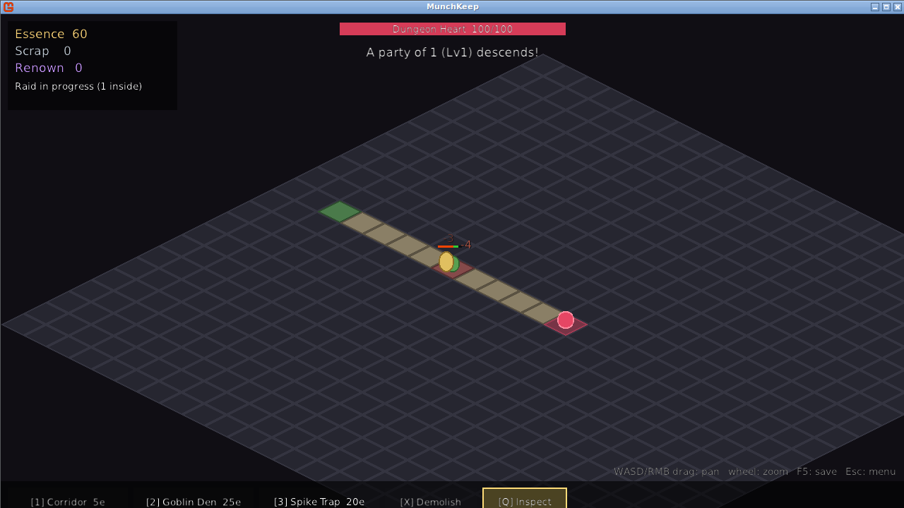

# MunchKeep

*You are the dungeon. They are the food.*

MunchKeep is an idle, isometric 2D dungeon-management game inspired by the Boss
Monster board game, built with **MonoGame (C#, .NET 8, DesktopGL)**. You play as a
living dungeon: lure adventurer parties in, kill them with goblins and traps,
harvest their remains, and spend the loot to grow ever more infamous.



## The loop

1. Renown-scaled **parties of adventurers** (1–3 heroes) descend every ~45s and
   pathfind (A*) from the Entrance toward your **Dungeon Heart**.
2. They fight your **goblin dens** and trigger your **spike traps** along the way.
3. The dead dissolve into **Life Essence** (build currency) and **Scrap**
   (upgrade currency).
4. Spend Essence to dig corridors and build rooms; spend Scrap to level up
   goblins. Killing heroes raises **Renown**, which attracts bigger, richer parties.
5. Heroes who survive to the Heart wound it and **steal from your stockpile**.
   If the Heart shatters you lose a chunk of resources and renown — a setback,
   never a game over. It regrows to half strength.
6. Close the game and it keeps munching: **capped offline earnings** (8h, 50%
   efficiency, based on your measured income rate) greet you on return.

## Controls

| Input | Action |
|---|---|
| `WASD` / arrows / RMB-drag | Pan camera |
| Mouse wheel | Zoom (toward cursor) |
| `1` / `2` / `3` | Build corridor / goblin den / spike trap (click a tile) |
| `X` | Demolish mode (50% refund) |
| `Q` | Inspect mode (click a room to select) |
| `U` | Upgrade selected goblin den (costs Scrap) |
| `F5` | Save (autosaves every 60s and on exit) |
| `Esc` | Cancel mode → menu |

New rooms must touch the existing dungeon. Heroes always take the shortest path,
so the real game is routing them: demolish and rebuild to force the only way to
the Heart through your kill-corridor.

## Building & running

```bash
dotnet run            # requires .NET 8 SDK
dotnet test           # 23 headless simulation tests
```

Saves live in `%APPDATA%/MunchKeep/save.json` (Windows) or
`~/.config/MunchKeep/save.json` (Linux/macOS).

## Architecture

The codebase is split along one hard rule — **`Source/Simulation` contains no
MonoGame types**. The whole game world advances by fixed 100ms ticks in plain C#,
which is what makes the offline resolver, the deterministic seeds, and the fully
headless test suite (including a 30-simulated-minute auto-play session) possible.
The presentation layer interpolates between ticks for smooth 60fps rendering.

```
Source/
  Core/            GridPos, seeded Rng
  Simulation/      Sim (tick root), DungeonGrid, A*, heroes/mobs/traps/corpses,
                   economy, renown & party generation, offline resolver
  Presentation/    IsoMath + camera, sprite atlas, depth-sorted renderers,
                   floating text, HUD, screens (menu/play)
  Persistence/     JSON save DTOs + SaveManager
  Data/            balance.json loader
Content/
  Data/balance.json   every tunable number in the game
  Assets/sprites.json sprite manifest (see below)
  Fonts/              bundled TTF (FontStashSharp renders text at runtime)
MunchKeep.Tests/   xUnit suite for the simulation layer
```

Isometric rendering uses the classic 2:1 diamond projection with painter's-
algorithm depth (`layerDepth` banded by `x + y`) in a single
`SpriteSortMode.FrontToBack` pass.

## Art pipeline (placeholder → real assets)

There is **no MGCB content pipeline** — PNGs and JSON load at runtime. All
drawing goes through logical sprite ids (`tile.corridor`, `unit.goblin`, …)
resolved via `Content/Assets/sprites.json`. Ids without a texture entry render
as generated placeholder shapes, which is what you see today.

To re-skin the game (e.g. with the CC0 [Kenney Isometric Miniature Dungeon](https://kenney.nl/assets/isometric-miniature-dungeon)
pack and character sprites from [Tiny Dungeon](https://kenney.nl/assets/tiny-dungeon)):
drop the PNGs under `Content/Assets/` and add `texture` (plus optional
`x/y/w/h`, `originX/originY`) to the matching manifest entries. No code changes,
no rebuild of content — tiles pivot at the diamond center, units at their feet,
and `tileWidth`/`tileHeight` in the manifest retune the projection to your pack.

## Balance

Every gameplay number — costs, HP, damage, renown curves, heart rules, offline
caps — lives in `Content/Data/balance.json`, hot-swappable without recompiling.
The compiled-in defaults match it, so the sim and tests run even without the file.
